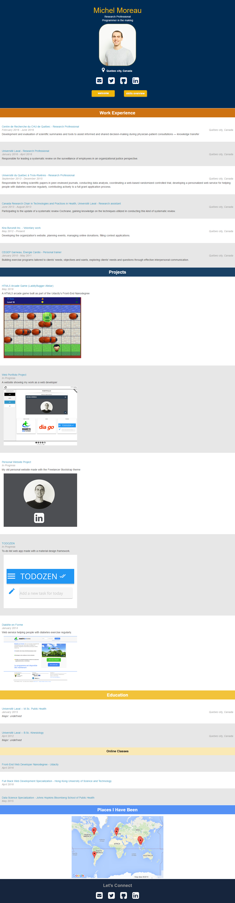

<<<<<<< HEAD
## What is this project?

This project was meant to be completed while being part of the Front-End developer Nanodegree at Udacity. Throughout this project I have built my resume by writing a JS script that combine my personal information with pre-written HTML and CSS templates to generate my resume.  
  
I also have made careful adjustments to the default design of the template that was given.  
  
I finally have created a gulp file to automate build tasks and to optimize my website before making it available online.

### What was learned from this project?

1. JavaScript syntax
2. Manipulating data types (JSON)  
3. Perfecting my loops skills and function creation.  
4. AJAX requests
5. jQuery DOM manipulation

### Preview

link to the website: [michelmoreau.ca](http://michelmoreau.ca/)

=======
## (SITE IN CONSTRUCTION) What is this project?

This project was meant to be completed while being part of the Front-End developer Nanodegree at Udacity. Throughout this project I have built my resume by writing a JS script that combine my personal information with pre-written HTML and CSS templates to generate my resume.  
  
I also have made careful adjustments to the default design of the template that was given.  
  
I finally have created a gulp file to automate build tasks and optimize the website before making it available online.

### What was learned from this project?

1. JavaScript syntax
2. Manipulating data types (JSON)  
3. Perfecting my loops skills and function creation.  
4. AJAX requests
5. jQuery DOM manipulation

### Preview

link to the website: [http://michelml.github.io/resume-builder/dist/](http://michelml.github.io/resume-builder/dist/)

>>>>>>> 1c74af5e0aef03a9eb8d786e21425aa393f41d30
